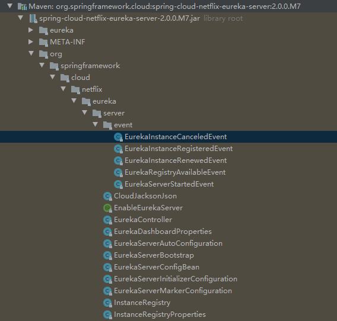

Spring-Cloud

# 1. Eureka

## 1.1 Eureka 事件


- EurekaInstanceCanceledEvent  :失效事件


- EurekaInstanceRegisteredEvent : 注册事件



- EurekaInstanceRenewedEvent :心跳事件


- EurekaRegistryAvailableEvent :可用事件；


- EurekaServerStartedEvent: 启动事件


## 1.2 配置


## 1.3 Eureka监听服务状态

监听服务状态：


```
@Override
public void onApplicationEvent(ApplicationEvent applicationEvent) {
    // 服务挂掉自动通知
    if (applicationEvent instanceof EurekaInstanceCanceledEvent) {
        // 1. 失效事件；
        EurekaInstanceCanceledEvent event = (EurekaInstanceCanceledEvent) applicationEvent;
        // 获取当前Eureka实例中的节点信息
        PeerAwareInstanceRegistry registry = EurekaServerContextHolder.getInstance().getServerContext().getRegistry();
        Applications applications = registry.getApplications();
        // 遍历获取已注册节点中与当前失效节点ID一致的节点信息
        applications.getRegisteredApplications().forEach((registeredApplication) -> {
            registeredApplication.getInstances().forEach((instance) -> {
                if (instance.getInstanceId().equals(event.getServerId())) {
                    log.info("服务：" + instance.getAppName() + " 挂啦。。。");
                }
            });
        });


    }
     // 2.  EurekaInstanceRegisteredEvent 注冊事件；
    if (applicationEvent instanceof EurekaInstanceRegisteredEvent) {
        EurekaInstanceRegisteredEvent event = (EurekaInstanceRegisteredEvent) applicationEvent;
        log.info("服务：" + event.getInstanceInfo().getAppName() + " 注册成功啦。。。");
    }
    // 3. EurekaInstanceRenewedEvent 心跳事件；
    if (applicationEvent instanceof EurekaInstanceRenewedEvent) {
        EurekaInstanceRenewedEvent event = (EurekaInstanceRenewedEvent) applicationEvent;
        log.info("心跳检测服务：" + event.getInstanceInfo().getAppName() + "。。");
    }
     // 4.EurekaRegistryAvailableEvent 可用事件；
    if (applicationEvent instanceof EurekaRegistryAvailableEvent) {
        log.info("服务 Aualiable。。");
    }

}
```


#2.  项目实际配置


- api 服务

    支付订单等服务器；


# 3. ace-admin

##3.1 ace-center 

**重点注解**

@EnableEurekaServer  //启动一个服务注册中心提供给其他应用进行对话


```
@EnableDiscoveryClient
@Target({ElementType.TYPE})
@Retention(RetentionPolicy.RUNTIME)
@Documented
@Import({EurekaServerMarkerConfiguration.class})
public @interface EnableEurekaServer {
}
```


```
@EnableEurekaServer  //启动一个服务注册中心提供给其他应用进行对话
@SpringBootApplication
public class CenterBootstrap {
    public static void main(String[] args) {
        SpringApplication.run(CenterBootstrap.class, args);
    }
}
```

application.yml


```
spring:
    application:
        name: ace-center

server:
    port: 8761 #启动端口

eureka:
    client:
        registerWithEureka: false  #false:不作为一个客户端注册到注册中心
        fetchRegistry: false      #为true时，可以启动，但报异常：Cannot execute request on any known server
    server:
        enable-self-preservation: false          # 设为false，关闭自我保护
        eviction-interval-timer-in-ms: 60000     # 清理间隔（单位毫秒，默认是60*1000）
```

http://localhost:8761/


```
@EnableScheduling
public class EurekaInstanceCanceledListener implements ApplicationListener {
```

// 对事件进行监听

```
@Override
public void onApplicationEvent(ApplicationEvent applicationEvent) {
    // 服务挂掉自动通知
    if (applicationEvent instanceof EurekaInstanceCanceledEvent) {
        // 1. 失效事件；
        EurekaInstanceCanceledEvent event = (EurekaInstanceCanceledEvent) applicationEvent;
        // 获取当前Eureka实例中的节点信息
        PeerAwareInstanceRegistry registry = EurekaServerContextHolder.getInstance().getServerContext().getRegistry();
        Applications applications = registry.getApplications();
        // 遍历获取已注册节点中与当前失效节点ID一致的节点信息
        applications.getRegisteredApplications().forEach((registeredApplication) -> {
            registeredApplication.getInstances().forEach((instance) -> {
                if (instance.getInstanceId().equals(event.getServerId())) {
                    log.info("服务：" + instance.getAppName() + " 挂啦。。。");
                }
            });
        });


    }
     // 2.  EurekaInstanceRegisteredEvent 注冊事件；
    if (applicationEvent instanceof EurekaInstanceRegisteredEvent) {
        EurekaInstanceRegisteredEvent event = (EurekaInstanceRegisteredEvent) applicationEvent;
        log.info("服务：" + event.getInstanceInfo().getAppName() + " 注册成功啦。。。");
    }
    // 3. EurekaInstanceRenewedEvent 心跳事件；
    if (applicationEvent instanceof EurekaInstanceRenewedEvent) {
        EurekaInstanceRenewedEvent event = (EurekaInstanceRenewedEvent) applicationEvent;
        log.info("心跳检测服务：" + event.getInstanceInfo().getAppName() + "。。");
    }
     // 4.EurekaRegistryAvailableEvent 可用事件；
    if (applicationEvent instanceof EurekaRegistryAvailableEvent) {
        log.info("服务 Aualiable。。");
    }

}
```


## 3.2 ace-uc

###3.2.1 启动方法


```
@EnableEurekaClient
@EnableDiscoveryClient
public class UCBootstrap {
    public static void main(String[] args) {
        SpringApplication.run(UCBootstrap.class,args);
    }
}
```


### 3.2.2 注解

```
spring:
  application:
    name: user-center

# 解决多网卡环境下的IP选择问题;
eureka:
  instance:
    prefer-ip-address: true
    ip-address: 127.0.0.1

#^
  #Duplicate key: eureka
  # in 'reader', line 14, column 49:
#eureka:
  client:
    service-url:
      defaultZone: http://localhost:8761/eureka/
```


http://localhost:8761/user-center


# 4. Eureka 总结

- 如何快速剔除停掉的服务
- IP选择


```
eureka:
    client:
        registerWithEureka: false  #false:不作为一个客户端注册到注册中心
        fetchRegistry: false      #为true时，可以启动，但报异常：Cannot execute request on any known server
    server:
        enable-self-preservation: false          # 设为false，关闭自我保护
        eviction-interval-timer-in-ms: 60000     # 清理间隔（毫秒，默认是60*1000）,1分钟清理
```

- false 关闭自我保护 


```
enable-self-preservation: false       # 设为false，关闭自我保护，若服务清掉，则在eureka列表中看不到；
```